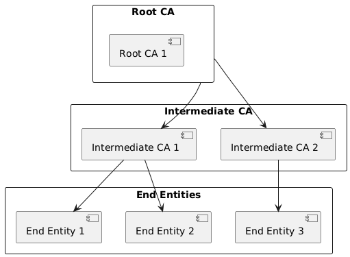

# Certificate Authorities

## Definition of a Certificate Authority (CA)
A Certificate Authority (CA) is a trusted entity responsible for issuing and managing digital certificates. These certificates verify the identity of entities (such as websites, individuals, and organizations) and enable secure, encrypted communications over networks. By providing a trusted third-party validation, CAs play a crucial role in ensuring the integrity and security of digital interactions.

## Role of CAs in PKI
In a Public Key Infrastructure (PKI), Certificate Authorities serve as the cornerstone for establishing trust. Their primary roles include:

1. **Issuing Digital Certificates**: CAs verify the identity of entities and issue digital certificates that bind a public key with an identity.
2. **Maintaining Certificate Revocation Lists (CRLs)**: CAs track and publish lists of revoked certificates to ensure invalid or compromised certificates are not trusted.
3. **Facilitating Secure Communications**: By enabling encryption and secure connections, CAs ensure that data transmitted over networks is protected from unauthorized access and tampering.
4. **Ensuring Compliance and Governance**: CAs adhere to strict security standards and policies to maintain the integrity and trustworthiness of the PKI.

## Types of CAs (Root CAs, Intermediate CAs)
CAs are categorized based on their position and function within the PKI hierarchy:

1. **Root Certificate Authorities**:
   - The highest level of trust in a PKI.
   - Root CAs issue certificates to Intermediate CAs.
   - Their private keys are highly protected as compromise can undermine the entire PKI.
   
2. **Intermediate Certificate Authorities**:
   - Serve as intermediaries between the Root CA and end entities (e.g., users, websites).
   - Issue certificates to end entities and/or subordinate CAs.
   - Help distribute the trust anchor, reducing risk if an intermediate CA is compromised.
   
3. **Subordinate Certificate Authorities**:
   - These can be further sub-divided from Intermediate CAs.
   - Often used to manage certificates within specific domains or organizations.

## CA Hierarchies
A CA hierarchy is a structure of multiple CAs organized to enhance security and manageability. The common hierarchical models include:

1. **Single CA**:
   - A simple model with a single CA issuing all certificates.
   - High risk as the single CA's compromise can affect the entire PKI.
   
2. **Two-tier Hierarchy**:
   - Consists of a Root CA and multiple Intermediate CAs.
   - Intermediate CAs issue end-entity certificates, reducing the risk associated with the Root CA.
   
3. **Three-tier Hierarchy**:
   - Adds an additional layer of Subordinate CAs below Intermediate CAs.
   - Provides further compartmentalization and enhances security by limiting the scope of each CA.

## Process of Certificate Issuance by a CA
The process of issuing a certificate by a CA involves several steps:

1. **Certificate Signing Request (CSR)**:
   - The entity requesting the certificate generates a CSR, including its public key and identity information.
   
2. **Validation**:
   - The CA verifies the identity of the requestor using various methods (e.g., domain validation, organizational vetting).
   
3. **Issuance**:
   - Once validated, the CA signs the CSR with its private key, creating a digital certificate.
   - The certificate is then provided to the requestor.
   
4. **Publication**:
   - The issued certificate is published in a repository accessible to users, allowing them to verify the certificate's validity.
   
5. **Management**:
   - The CA maintains records of issued certificates and manages renewals and revocations as needed.

By understanding these core aspects of Certificate Authorities, you can effectively implement and manage PKI systems to ensure secure and trusted digital communications.